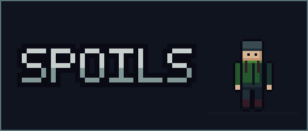
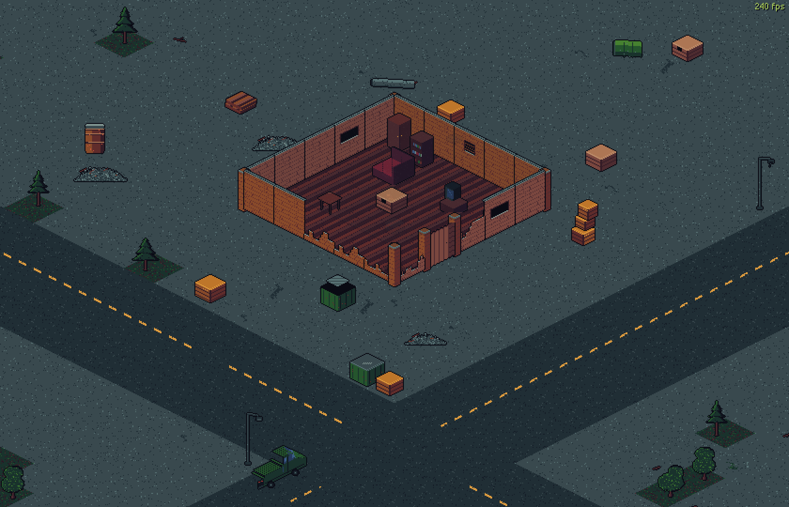
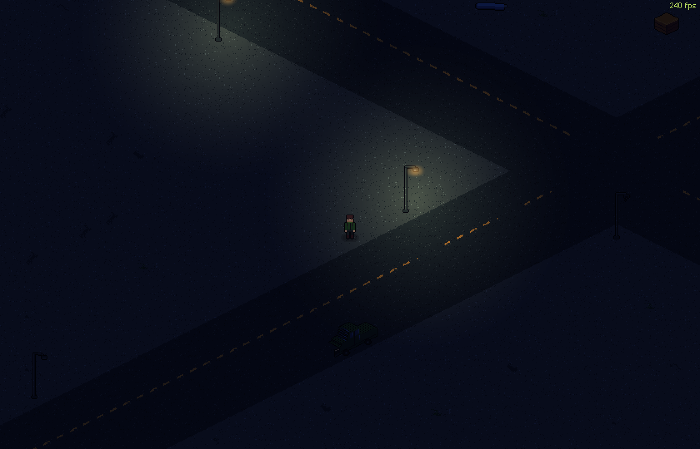
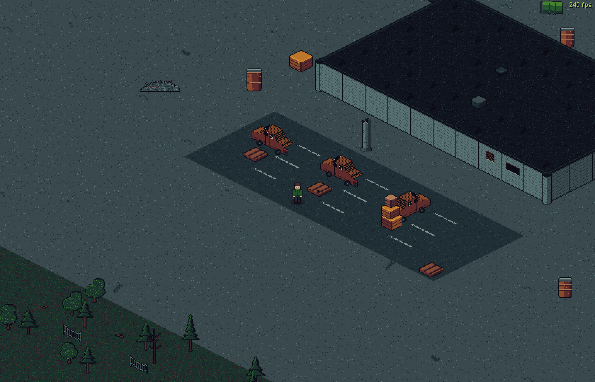
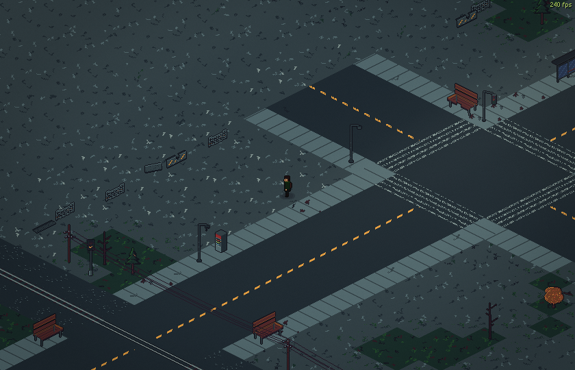

<p align="center">
  
</p>

<p align="center">
  <em>Loot the ruins. Dodge what hunts you. Get out — or lose it all.</em>
</p>

<p align="center">
  
  
  
  
</p>

---

**SPOILS** is a 2D isometric **extraction shooter** in pixel art. Deploy into a
sealed, picked-over district, fill your backpack, and reach an extraction point
before the timer runs out — **die and you lose everything you carried**. What
you extract funds the next run: a persistent stash, a trader, and gear choices
that are really risk choices.

The stakes and the loot are *Escape from Tarkov*'s — raid loop, grid inventory,
gear slots, no second chances. The gun-feel goal is *Destiny*'s — punchy,
juicy weapons — at 32 pixels tall. Nothing supernatural ever happened here:
**every enemy is a human being**, and every one of them wants your bag.

> **Status:** early development. The world is in: the district of **transit** —
> one fixed, learnable map with day/night, real weather, interactive doors,
> driveable cars, a working extraction, and a sniper watching its edges.
> Gunplay is next. See the [changelog](CHANGELOG.md).

## Screenshots

| A raider's morning | Night finds the last working lamps |
| :---: | :---: |
|  |  |

| The loading yard | The edge of the map |
| :---: | :---: |
|  |  |

## The world so far

- **transit — one fixed district.** A hand-picked 256×256 iso layout that is
  **the same every single raid**, on purpose: quests will send you to real
  addresses, and raiders are supposed to know the ground. Zoned into a town
  with a courtyard, warehouses, a two-story school over its playground, a
  trainyard, a bus depot, a scrapyard, a comms relay, a graffiti gallery, an
  autumn grove, and the safehouse you wake up in. The art is still generated
  from a seed — that seed is simply pinned, so the generator *is* the map file.
- **Ways out.** Extraction is live: reach the green-smoked landing zone and a
  helicopter comes in over the treeline for you, then a debrief screen tallies
  the run. A toll gate and a night freight are on the way.
- **Cars you can drive.** Get in, the engine starts; WASD across eight drawn
  facings, headlights, honest collisions, and a thump when you clip something.
- **A living sky**: a 10-minute day/night cycle with properly dark nights,
  dawn fog, rain spells whose drops fall through the world and splash where
  they land, distant lightning, puddles that fill and dry, and leaves that
  shed in the colour of the tree that dropped them.
- **Doors that open** (walk up, press F), **second stories** with real stairs,
  a **flashlight** for the dark (E), street lamps that flicker — the few that
  still work, and a district map on **M** with a live marker for where you are.
- **The edge is a place**: barricades mark the end of the playable district.
  The world continues beyond them — but a sniper owns it. You will be warned
  once.
- **240 Hz native**: the renderer targets perfectly even pixel scrolling at
  high refresh rates, with a frame-pacing harness to prove it.

## How to play

Right now SPOILS runs from source with Godot:

1. Install [Godot 4.7.1](https://godotengine.org/download/windows/) (standard build).
2. Clone this repository.
3. Run the project:
   ```
   godot --path .
   ```
   On the development machine, double-clicking `Play.bat` does the same thing.

### Controls

| Input | Action |
| --- | --- |
| **WASD** / Arrow keys | Move — and drive, once you're in a car |
| **Ctrl** | Crouch (hold, or toggle — see settings) |
| **Z** | Prone (crawl — slow, low) |
| **F** | Interact — doors, stairs, cars. Only ever what the prompt offers |
| **E** | Flashlight — headlights when driving |
| **M** | The district map |
| **Mouse wheel** | Zoom |
| **Esc** | Pause menu (settings, keybinds, quit) |

Every key is rebindable in **Esc → settings → keybinds**. The game runs
borderless fullscreen at a pixel-perfect integer scale; display mode, FPS cap,
and VSync live in settings too.

## Roadmap

- [x] **Milestone 1 — Walkable world:** the district of transit, generated art,
      weather, doors, day/night, the barricade line and its sniper
- [ ] **Milestone 2 — Gunplay** *(v0.7)*: mouse aim, tracers, muzzle flash,
      screen shake, synthesized gun sound, destructible props
- [ ] **Milestone 3 — Enemies** *(v0.8)*: human scav AI — patrol, chase,
      shoot — health, death, loot drops
- [ ] **Milestone 4 — The loop** *(v0.9)*: Tarkov-style loot — grid inventory
      with item footprints, searchable containers, character doll gear slots —
      raid timer, death = loss, persistent stash *(extraction shipped early —
      the landing zone is already in)*
- [ ] **Milestone 5 — The living raid** *(v1.0)*: human-like "fake player"
      bots that loot, fight, and extract; dynamic lighting; the trader
- [ ] **Milestone 6 — Quests** *(v1.1)*: trader tasks, rewards, unlocks
- [ ] **Milestone 7 — A second map** *(v1.2)*

## Development notes

- **Everything is generated.** Every sprite in the game is produced by
  [`tools/gen_art.py`](tools/gen_art.py) from the
  [Apollo palette](art/palettes/apollo.gpl) — no hand-drawn files, no external
  assets. If an asset looks wrong, the generator gets fixed and everything
  regenerates. Mechanical sounds are synthesized at runtime the same way;
  organic audio (menu music, footsteps, thunder) is licensed recordings —
  music by davidkbd (cc-by 4.0), footsteps by congusbongus and freesound
  contributors swuing, ceberation, ali_6868 (cc-by 3.0), thunder by gregor
  quendel (cc-by 4.0); see [assets/audio/LICENSES.md](assets/audio/LICENSES.md).
- **Self-verifying builds.** A headless smoke test
  (`godot --headless --path . -- --smoke`) checks that the world builds, the
  player moves, collision holds, doors toggle, the edge sniper fires, and the
  menus work. A screenshot harness (`--shot=<name>`, with seed pinning via
  `--seed=`) captures the game's actual output for visual review, and frame
  pacing probes (`--perf`, `--perf-deploy`) watch for dropped frames. All of it
  runs before anything is called done.
- **Multiplayer-shaped from day one.** All authoritative state changes (spawns
  and damage now; loot and extraction later) route through a single authority
  layer, so a real PvPvE server can own them someday without a rewrite.
