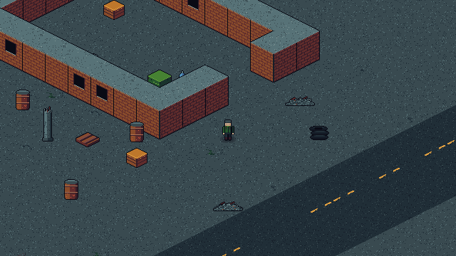
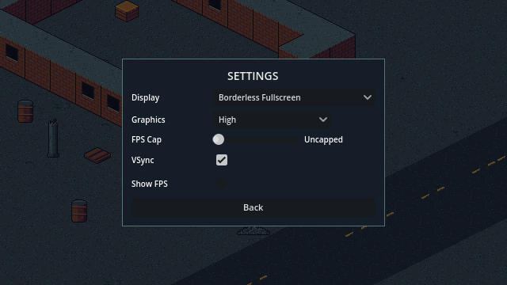

<p align="center">
  
</p>

<p align="center">
  <em>Loot the ruins. Dodge what hunts you. Get out — or lose it all.</em>
</p>

<p align="center">
  
  
  
  
</p>

---

**SPOILS** is a 2D isometric **extraction shooter** in pixel art. Deploy into a
machine-haunted ruined city, fill your backpack, and reach an extraction point
before the timer runs out — **die and you lose everything you carried**. What
you extract funds the next run: a persistent stash, a trader, and gear choices
that are really risk choices.

The game takes its world from the machine-patrolled topside ruins of
*ARC Raiders*, its stakes from *Escape from Tarkov*'s raid loop, and its
gun-feel goals from *Destiny* — punchy weapons and color-coded loot, at
32 pixels tall.

> **Status:** early development. The world, movement, and rendering foundation
> are in (Milestone 1). Gunplay is next. See the [changelog](CHANGELOG.md).

## Screenshots

| The ruined block | Settings |
| :---: | :---: |
|  |  |

## How to play

Right now SPOILS runs from source with Godot:

1. Install [Godot 4.7.1](https://godotengine.org/download/windows/) (standard build).
2. Clone this repository.
3. Run the project:
   ```
   godot --path .
   ```
   On the development machine, double-clicking `Play.bat` does the same thing.

### Controls

| Input | Action |
| --- | --- |
| **WASD** / Arrow keys | Move |
| **Esc** | Pause menu (settings, quit) |

The game runs borderless fullscreen by default at a pixel-perfect integer
scale; display mode, FPS cap, and VSync live in **Esc → Settings**.

## Roadmap

- [x] **Milestone 1 — Walkable world:** iso map, generated art, movement, camera
- [ ] **Milestone 2 — Gunplay:** mouse aim, tracers, muzzle flash, screen shake, synthesized sound
- [ ] **Milestone 3 — Enemies:** scav AI (patrol → chase → shoot), health, loot drops
- [ ] **Milestone 4 — The loop:** containers, inventory, extraction, raid timer, death = loss, stash
- [ ] **Milestone 5 — The world bites back:** machine patrols, human-like "fake player" bots, dynamic lighting, trader

## Development notes

- **Everything is generated.** Every sprite in the game is produced by
  [`tools/gen_art.py`](tools/gen_art.py) from the
  [Apollo palette](art/palettes/apollo.gpl) with a fixed seed — no hand-drawn
  files, no external assets. If an asset looks wrong, the generator gets fixed
  and everything regenerates. Audio will be synthesized at runtime the same way.
- **Self-verifying builds.** A headless smoke test
  (`godot --headless --path . -- --smoke`) checks that the world builds, the
  player moves, collision holds, and the menu works; a screenshot harness
  (`godot --path . -- --shot=<name>`) captures the game's actual output for
  visual review. Both run before anything is called done.
- **Multiplayer-shaped from day one.** All authoritative state changes (spawns
  now; damage, loot, extraction later) route through a single authority layer,
  so a real PvPvE server can own them someday without a rewrite.
