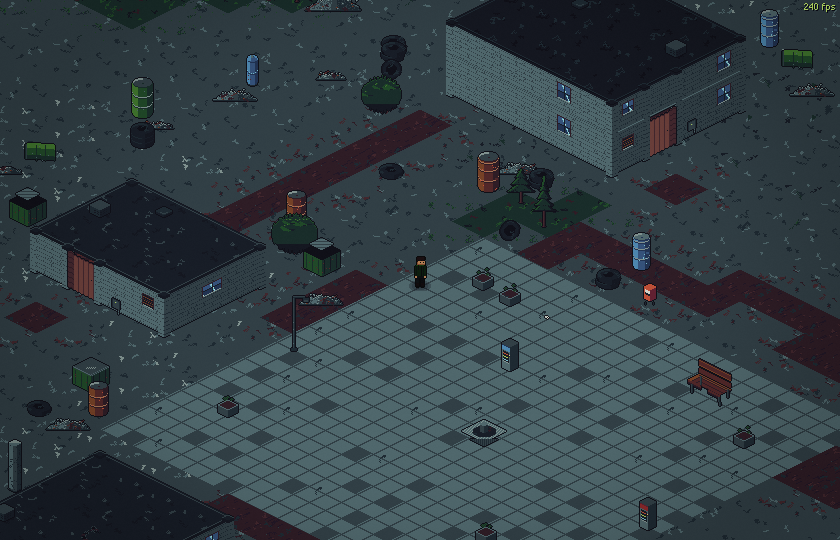
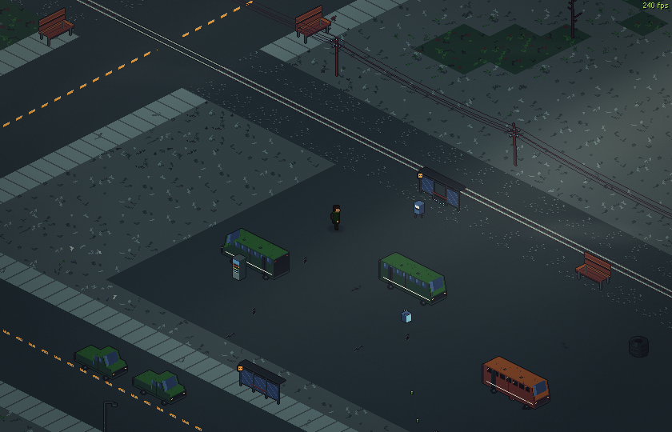
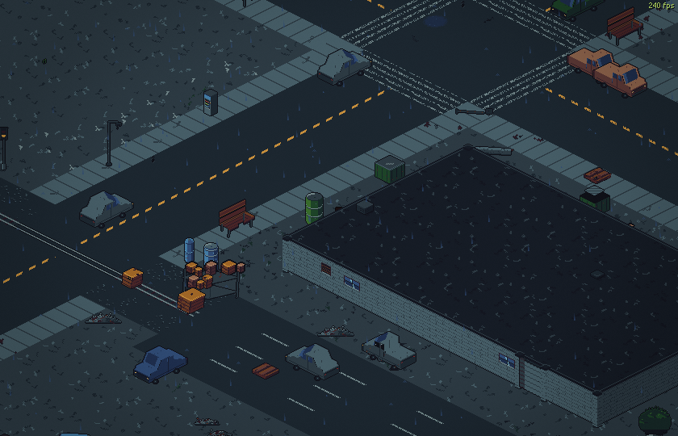
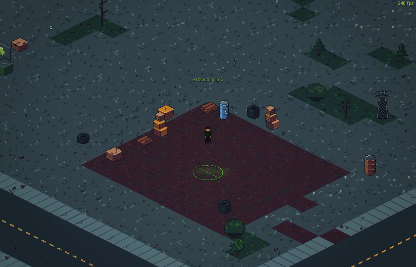
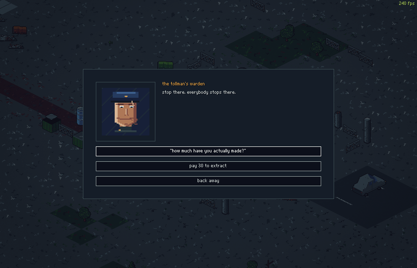
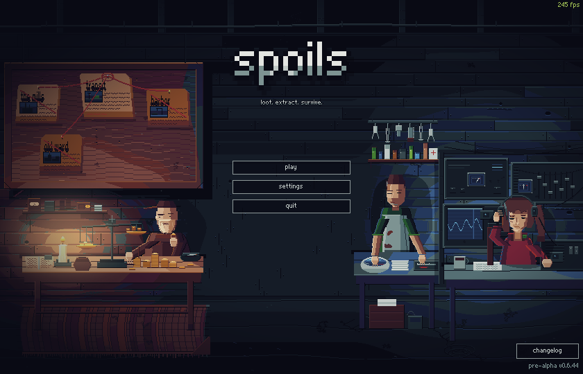
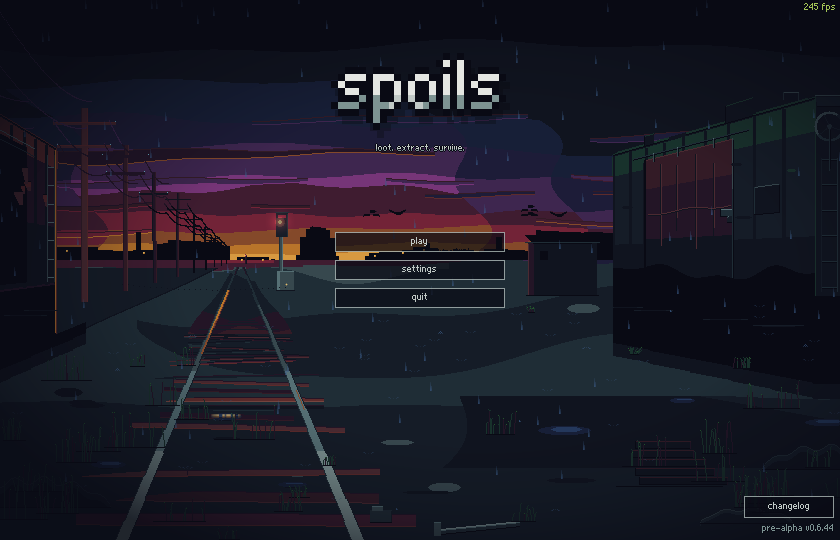
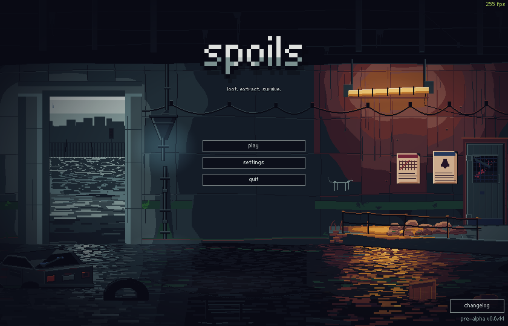
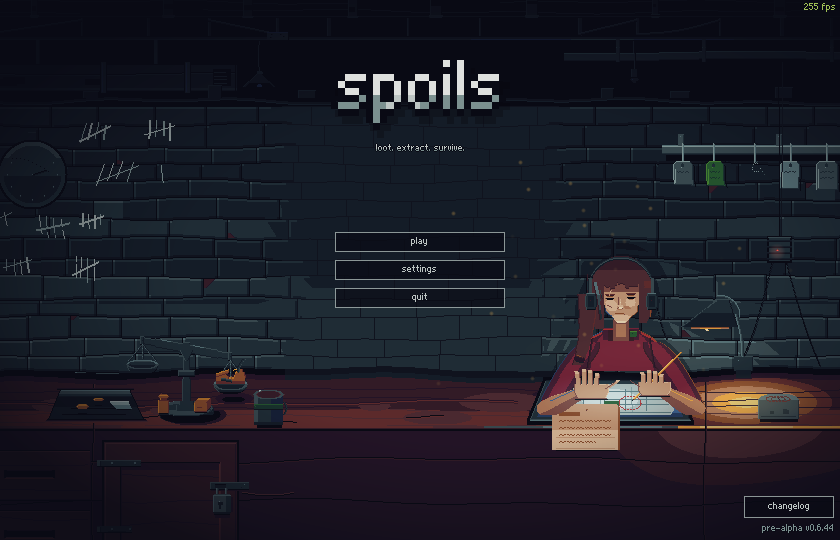

<p align="center">
  
</p>

<p align="center">
  <em>Loot the ruins. Dodge what hunts you. Get out — or lose it all.</em>
</p>

<p align="center">
  
  
  
  
</p>

---

**SPOILS** is a 2D isometric **extraction shooter** in pixel art. Deploy into a
sealed, picked-over district, fill your backpack, and reach an extraction point
before your luck runs out — **die and you lose everything you carried**. What
you extract funds the next run: a persistent stash, a trader, and gear choices
that are really risk choices.

The stakes and the loot are *Escape from Tarkov*'s — raid loop, grid inventory,
gear slots, no second chances. The gun-feel goal is *Destiny*'s — punchy,
juicy weapons — at 32 pixels tall. Nothing supernatural ever happened here:
**every enemy is a human being**, and every one of them wants your bag.

> **Status:** early development, and honest about it. The **world** is in — one
> fixed district with day/night, real weather, doors, driveable cars, three
> working extractions and a sniper watching its edges. **Guns are next.**
> See the [changelog](CHANGELOG.md) for what shipped when.

---

## What you actually do

You are **magpie** — a scavenger working the ruins of a city nobody is allowed
to name. A run goes like this:

1. **Deploy.** You drop into the district from the safehouse. The clock is
   already running and the weather is whatever it is.
2. **Work the ground.** Doors open, buildings have insides and upstairs, cars
   start if you get in them. The map is *the same every raid* on purpose —
   knowing which house has a back way out is supposed to be a skill.
3. **Decide when enough is enough.** Everything you pick up is only yours if
   you leave with it.
4. **Get out.** Three ways, all live:
   - **The lift** — stand in the green smoke, hold the pad, and a helicopter
     comes in over the treeline for you.
   - **The toll gate** — the warden will let you drive out through the wire.
     He will want paying, and he sets the price.
   - **The night freight** — board it before it goes and ride out of the
     district.
5. **Or don't.** Wander past the barricades and a marksman on the wire warns
   you exactly once.

| Deploying into transit | The bus depot |
| :---: | :---: |
|  |  |

| Rain on the crossroads | Night, and the few lamps that still work |
| :---: | :---: |
|  |  |

| The lift is inbound | The toll gate — he sets the price |
| :---: | :---: |
|  |  |

<p align="center">
  <br>
  <em>The barricades are the edge of the map. The world keeps going. So does the sniper.</em>
</p>

---

## The story so far

Six years ago the city broke in the space of one autumn week. The official line
— the one printed on evacuation notices people still find in drawers — called
it *"a contamination event of undetermined origin."* The street never bought
it. Ask three people and you get three answers: something got out of a lab
under the spires; the water went bad first and the riots did the rest; the
government needed one city to fail so the others would obey.

What is not in dispute: on the seventh night the army stopped evacuating and
started building. They called it containment. The city called it **the cordon**.
Nobody official has said the city's name since — as if the word itself were
quarantined. People just say **"inside."**

The cordon is lattice fence, floodlight towers and patience, run by the
**wardens**, whose one rule has never changed: *nobody crosses, nothing comes
out.* Raiders judge each stretch of wire by its repairs — fresh weld means
warden attention, rust means a sleepy sector, plastic sheeting means a crossing
somebody pretends not to see, **for a price**.

You came to the wire in year five with nothing but a creased photograph of two
kids on a pickup's tailgate. The other kid is **tomas** — your brother, who was
working inside the week it broke. Everyone said the same thing for five years:
*nobody comes out.* Then someone in a border bar said the word "raiders."

### The den

Home is the old transit maintenance depot just outside the wire, and three
people keep it running:

- **mara** — transit authority radio dispatcher, on shift the night the phones
  died. Ran her control room for nine days while the wire went up, calling
  routes for buses that stopped coming back. She walked out with the duty radio
  and the maps in her head. She runs the board, the jobs and the extracts. The
  voice in your ear.
- **kettle** — a pawnbroker's son who got out on a flatbed with three
  suitcases: two of stock, one of scales and ledgers. He'll buy anything,
  *"even the kettle."* Knows the price of everything. Won't say what's in the
  third suitcase.
- **verne** — the medic, and the one who patches you up when a run goes badly.

The menu shows the world you work in — the den, the trainyard, the flooded
underpass, mara's counter — and every one of them is alive: lamps fail, water
runs, rain lands, birds cross the sunset.

| The den | The trainyard at dusk |
| :---: | :---: |
|  |  |

| The flooded underpass | mara's counter |
| :---: | :---: |
|  |  |

---

## The world so far

- **transit — one fixed district.** A hand-picked 256×256 iso layout that is
  **the same every single raid**, on purpose: quests will send you to real
  addresses, and raiders are supposed to know the ground. Zoned into a town
  with a courtyard, warehouses, a two-story school over its playground, a
  trainyard, a bus depot, a scrapyard, a comms relay, a graffiti gallery, an
  autumn grove, and the safehouse you wake up in. The art is still generated
  from a seed — that seed is simply pinned, so the generator *is* the map file.
- **Three ways out**, all live, all ending on a debrief that tallies the run.
- **Cars you can drive.** Get in, the engine starts; WASD across eight drawn
  facings, headlights, honest collisions, and a thump when you clip something.
- **A living sky**: an 18-minute day/night cycle with properly dark nights, a
  sun that moves — warm and low in the morning, gold through the afternoon —
  dawn fog, four kinds of weather (clear, overcast, rain, storm), rain whose
  drops fall to real ground points and splash where they land, distant
  lightning, puddles that fill and dry, and leaves that shed in the colour of
  the tree that dropped them.
- **Doors that open** (walk up, press F), **second stories** with real stairs,
  a **flashlight** for the dark (E), street lamps that flicker — the few that
  still work — and a district map on **M** with a live marker for where you are.
- **The edge is a place**: barricades mark the end of the playable district. The
  world continues beyond them — but a sniper owns it. You will be warned once.
- **240 Hz native**: the renderer targets perfectly even pixel scrolling at high
  refresh rates, with a frame-pacing harness to prove it.

---

## How to play

SPOILS runs from source with Godot:

1. Install [Godot 4.7.1](https://godotengine.org/download/windows/) (standard build).
2. Clone this repository.
3. Run the project:
   ```
   godot --path .
   ```
   That assumes `godot` is on your PATH. **It is not on the development
   machine** — there the engine lives at
   `D:\Godot\Godot_v4.7.1-stable_win64_console.exe` and every command in the
   project docs types that path in full. Double-clicking `Play.bat` does the
   same thing.

### Controls

| Input | Action |
| --- | --- |
| **WASD** / Arrow keys | Move — and drive, once you're in a car |
| **Ctrl** | Crouch (hold, or toggle — see settings) |
| **Z** | Prone (crawl — slow, low) |
| **F** | Interact — doors, stairs, cars. Only ever what the prompt offers |
| **E** | Flashlight — headlights when driving |
| **M** | The district map |
| **Mouse wheel** | Zoom |
| **Esc** | Pause menu (settings, keybinds, quit) |

Every key above **except Esc and the zoom wheel** is rebindable in
**Esc → settings → keybinds**, which also covers reload, inventory and the
weapon slots. Pause is the engine's built-in `ui_cancel` and the wheel zoom is
fixed; neither appears in `Settings.BIND_ACTIONS` (14 actions), which is the
only thing the keybinds panel iterates. The game runs borderless fullscreen at
a pixel-perfect integer scale; display mode, FPS cap and VSync live in settings
too.

### Getting out alive

- The **lift** needs you to stay on the pad — walk off and the count resets.
- The **warden** remembers being paid for the rest of the raid, so you can
  drive back in and out again on one toll.
- The **freight** leaves on its own schedule. Miss it and you wait.
- **Dying ends the raid.** There is no respawn into the same run.

---

## Roadmap

- [x] **Milestone 1 — Walkable world:** the district of transit, generated art,
      weather, doors, day/night, the barricade line and its sniper
- [ ] **Milestone 2 — Gunplay** *(v0.7)*: mouse aim, tracers, muzzle flash,
      screen shake, synthesized gun sound, destructible props
- [ ] **Milestone 3 — Enemies** *(v0.8)*: human scav AI — patrol, chase,
      shoot — health, death, loot drops
- [ ] **Milestone 4 — The loop** *(v0.9)*: Tarkov-style loot — grid inventory
      with item footprints, searchable containers, character doll gear slots —
      raid timer, death = loss, persistent stash *(extraction shipped early —
      all three exits are already in)*
- [ ] **Milestone 5 — The living raid** *(v1.0)*: human-like "fake player"
      bots that loot, fight, and extract; dynamic lighting; the trader
- [ ] **Milestone 6 — Quests** *(v1.1)*: trader tasks, rewards, unlocks
- [ ] **Milestone 7 — A second map** *(v1.2)*

---

## Development notes

- **Everything is generated.** Every sprite in the game is produced by
  [`tools/gen_art.py`](tools/gen_art.py) from the
  [Apollo palette](art/palettes/apollo.gpl) — no hand-drawn files, no external
  assets. If an asset looks wrong, the generator gets fixed and everything
  regenerates. Most mechanical sounds are synthesized at runtime the same way;
  organic audio (menu music, footsteps, thunder) and the car doors and engine
  are licensed recordings — music by davidkbd (cc-by 4.0), footsteps by
  congusbongus and freesound contributors swuing, ceberation, ali_6868
  (cc-by 3.0), thunder by gregor quendel (cc-by 4.0), car sounds by ggbotnet
  (cc0); see [assets/audio/LICENSES.md](assets/audio/LICENSES.md).
- **Self-verifying builds.** A headless smoke test
  (`--smoke`; on the dev machine
  `D:\Godot\Godot_v4.7.1-stable_win64_console.exe --headless --path . -- --smoke`,
  since `godot` is not on PATH there) checks that the world builds, the player
  moves, collision holds, doors toggle, the edge sniper fires, and the menus
  work. A screenshot harness (`--shot=<name>`, with seed pinning via `--seed=`)
  captures the game's actual output for visual review, `--film=<name>` captures
  a *sequence* for judging anything that moves, and frame-pacing probes
  (`--perf`, `--perf-deploy`) watch for dropped frames. All of it runs before
  anything is called done.
- **Multiplayer-shaped from day one.** All authoritative state changes (spawns
  and damage now; loot and extraction later) route through a single authority
  layer, so a real PvPvE server can own them someday without a rewrite.
